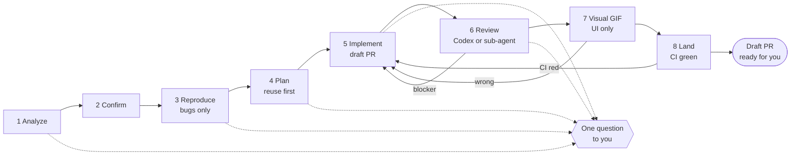
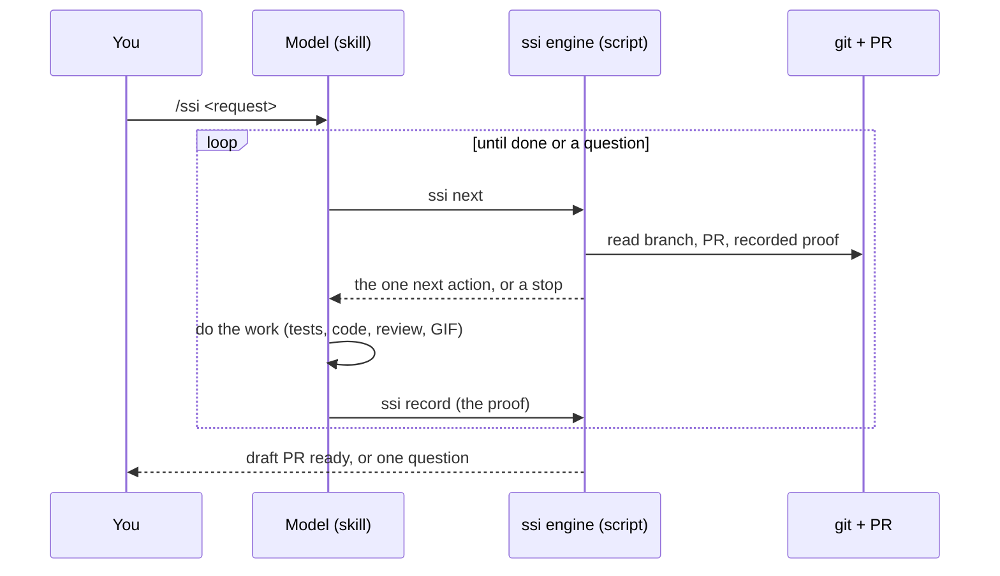

# SSI

One command takes a request to a **reviewed draft PR**. A small script, not the model, decides what comes next, so it remembers where it was and repairs itself after an interruption. It never merges, closes an Issue or deploys.

```text
/ssi Fix: total() ignores percentage discounts
```

## The flow



It runs on its own and asks **one** question only when it must: unclear request, no reproduction, protected code touched, a big diff, a review or CI that keeps failing, or an action outside its mandate.

## What happens inside



If the notes and the repo disagree, **the repo wins**. Lost local notes are restored from a block in the PR's progress comment. A new commit that touches proven files makes that proof stale and it is redone.

## What is different

Comparisons are about design, not quality: the projects below are good, and this one borrows from them.

| Common in prompt-only workflow skills | SSI |
|---|---|
| The model remembers the phase | A script derives the phase from git, the PR and recorded proof |
| You call each step or skill yourself | One entry point; it switches phases itself |
| Stopping is a judgement call | Stops and thresholds are computed (diff size, protected paths from the real diff, retry budgets) |
| An interrupted run starts over | It resumes, restores notes from the PR and redoes only stale proof |
| Review is the same model re-reading its work | Codex if it works, else a sub-agent on another model; the report says whether it was independent |
| Output tuned for experts | One short template: where we are, what happened, what is next, at most one question; optional `adhd` style |
| Remote side effects are ad hoc | Keyed and idempotent: no duplicate Issue or comment; evidence GIF on a `ssi-assets` branch |

## Install and use

Needs Node 20+, `git`, and `gh` logged in. Optional: Codex CLI (review), Chrome or Playwright and ffmpeg (GIF).

```bash
cp -R skills/ssi ~/.claude/skills/ssi          # the folder is self-contained
claude --plugin-dir .                          # or load the repo as a plugin
```

Settings live in `ssi.config.json` (repo) and `.ssi/config.local.json` (yours); `ssi config` prints them. Optional status band and phase map: `mods/ssi-cockpit`.

## Inspired by

- [mattpocock/skills](https://github.com/mattpocock/skills) and [jsmastery-pro/skills](https://github.com/jsmastery-pro/skills): engineering practices adapted into the phase guides.
- [DietrichGebert/ponytail](https://github.com/DietrichGebert/ponytail): the "smallest change that works" lens in planning.
- [ayghri/i-have-adhd](https://github.com/ayghri/i-have-adhd): the reader-friendly message rules.
- [openai/codex-plugin-cc](https://github.com/openai/codex-plugin-cc): how Codex is called (installed binary, read-only, optional model) and the review report shape.
- [obra/superpowers](https://github.com/obra/superpowers): the brainstorm, spec and plan process used to build this.

Exact versions and licences: [`skills/ssi/NOTICE.md`](skills/ssi/NOTICE.md). Design and history: [`docs/superpowers`](docs/superpowers).

## Status

Early. 126 engine tests, three real runs, and six rounds of Codex review; open findings are listed in the pull requests. MIT, see [LICENSE](LICENSE).
